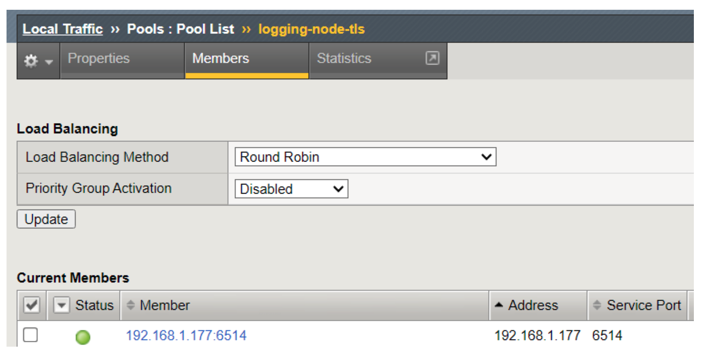

# AST API Discovery Tool

## Overview

The AST Local API Discovery Tool (LADT) is a fork of the
[Application Study Tool](https://github.com/f5devcentral/application-study-tool) focused on analyzing data 
about customer APIs based data from classic BIP logs.

The LADT receives per-http-request data from BigIP devices and stores relevant fields for periodic batch analysis.
Output of the analysis is a list of likely API endpoints, whether they are authenticated, and the number of requests processed by each endpoint.
API detection logic is based on a subset of official F5 product offerings, with some advanced 
functionality (e.g. schema discovery and Machine Learning analysis) excluded for performance reasons.

### Example API Detection Output


### System Overview
The Local API Discovery Tool relies on a specially crafted iRule to export per-request metadata to the
analysis system, running on-prem. The analysis system consists of:

* Opentelemetry Collector - For receiving incoming logs, processing, and forwarding them to storage system
* Clickhouse Database - For storing log data and running analysis queries
* Analysis Job - Runs periodically to generate results
* Grafana - For visualizing results, and system component states


## Getting Started

### Prerequisites

  * Linux system with docker (or compatible) - [Installation Instructions](https://docs.docker.com/engine/install/)
  * BigIP with logging iRule on your virtual server
  * Network connectivity (default TCP port 6514) between the BigIP and instance running LADT

#### System Recommendations
Minimal system specs for running the Local API Discovery Tool will depend heavily on expected traffic load.

The following performance characteristics were observed with an Intel(R) Xeon(R) Gold 6138 CPU @ 2.00GHz running localized testing
(single TCP+TLS connection meant to simulate a stream of data from a single BigIP Device). Actual message throughput
under real world network conditions would likely be quite a bit lower.

| Msg/Sec | Collector CPU Util | Clickhouse CPU Util | Collector Mem Util | Clickhouse Mem Util |
| ------- | ------------------ | ------------------- | ------------------ | ------------------- |
| 0       |         0.5%       |         0.8%        |         40MiB      |         546MiB      |
| 1       |         0.7%       |         1.3%        |        41.5MiB     |         629MiB      |
| 10      |         0.8%       |         1.6%        |         58MiB      |         629MiB      |
| 100     |         1.7%       |         1.8%        |         66MiB      |         646MiB      |
| 1000    |         8%         |         2.8%        |        115MiB      |         650MiB      |
| 10000   |        59.3%       |         40%         |        176MiB      |         698MiB      |
| 20000   |        133%        |         44%         |        216MiB      |         750MiB      |
| 30000   |        180%        |         47%         |        216MiB      |         798MiB      |
| 40000   |        235%        |         70%         |        225MiB      |         948MiB      |
| 54000   |        298%        |        106%         |        245MiB      |        1000MiB      |

The analysis script adds an additional ~10% CPU and 250MiB of load to the clickhouse instance while performing analysis.

| Analyzed Messages | Analysis Duration Sec |
| ----------------- | --------------------- |
|       1000        |        113ms          |
|      10000        |        0.9s           |
|     100000        |        6.67s          |
|     200000        |        14.7s          |
|      1.04M        |        1.12min        |
|       2.2M        |        2.51min        |
|        10M        |        4.06min        |


Disk space used likewise depends on volume, but clickhouse provides a good amount of compression
(here 758 million entries are stored in ~210MiB).

```
┬──────rows─┬─disk_size──┬─bytes_size─┬─compressed_size─┬─uncompressed_size─┬────────────────ratio─┐
│ 758799480 │ 210.24 MiB │  220452423 │ 209.25 MiB      │ 21.16 GiB         │  0.00965486284484136 │
```


### Installation

#### BigIP Virtual Server and iRule Configuration


1. Create a Standard Virtual Server, with port 6514


2. Create a Pool, with the Member being the Virtual Server created above - Service port 6514


4. Create another pool, with the containerized API discovery tool being the node member and assign this to the virtual server created in step #1



3. Attach the iRule to the virtual server that is receiving web traffic and set the variables to point to the pool created in step #2 (This will be a pool with the Virtual Server)The [api_irule.txt](api_irule.txt) file in this directory is required for exporting the data to the api discovery containers.


The flow of traffic is such:
1. Virtual Server receiving web traffic
2. The iRule attached will pass traffic to a pool (variable in iRule) that includes a Virtual Server created for syslogtls
3. The Virtual Server will send the data to the otel container
4. Dashboards will be presented via Grafana


#### Analysis Instance Configuration
Clone the repo or download source tarball from the [release](https://github.com/f5devcentral/ast-api-discovery/releases) section.

```shell
# Clone the repo
git clone https://github.com/f5devcentral/ast-api-discovery.git
# change directory
cd ast-api-discovery
# Make a copy of the example env file to use with the deployment
cp .env-example .env
# Edit the file to set your desired clickhouse user passwords
# and reconfigure the Grafana as desired
vi .env
```

### Configure TLS

The TCP listener in the default opentelemetry collector config is setup to expect files containing
certificate and key materials. The docker-compose file will mount the ./services/otel_collector folder
to /etc/otel-collector-config as a volume. Placing private key, certificate, and CA cert in
./services/otel_collector/ssl/(ca.pem|cert.pem|key.pem) will cause the collector to present these files
to the BigIP on connection. While not receommended, the TLS section can be removed to fall back to plain
TCP.

Otel Collector config in [./services/otel_collector/config.yaml](./services/otel_collector/config.yaml):
```yaml
receivers:
  ...
  syslog/tcp:
    tcp:
      listen_address: "0.0.0.0:54526"
      tls:
        ca_file: /etc/otel-collector-config/ssl/ca.pem
        cert_file: /etc/otel-collector-config/ssl/cert.pem
        key_file: /etc/otel-collector-config/ssl/key.pem
```


### Configure Grafana
The Grafana instance can be configured via environment variables using their standard
[options](https://grafana.com/docs/grafana/latest/setup-grafana/configure-grafana/#override-configuration-with-environment-variables).

The included .env-example can be copied over and modified to set the initial admin
password to a value you select:

```shell
# Make a copy of the example env file to use with the deployment
cp .env-example .env
# Edit the file to set your desired clickhouse user passwords
# and reconfigure the Grafana as desired
vi .env
```

### Run API Discovery Tool
Once the above configurations have been made, the tool can be started with:

```shell
docker compose up
```

#### View The Dashboards
The default Grafana user/pass is `admin/admin` or whatever you set in the .env file above,
and can be accessed at `http://<hostname>:3000`.


## Data Collected
The API Discovery tool uses the following fields for analysis (exported via BigIP iRule):

* URL Path (e.g. /api/v1/users)
* Host (e.g. www.example.com)
* HTTP Method (e.g. GET, POST)
* HTTP Response Status Code (e.g. 200, 401)
* Request Content Type (e.g. text/html, application/json)
* Response Content Type (e.g. text/html, application/json)
* HTTP Version (e.g. 1.1)
* Boolean indicating presense of an authorization header (but not the content of the header, e.g. True / False)

## Troubleshooting

### No Data
The analysis engine runs by default when the container starts, and then every 2 hours or 3 million records. If the API discovery
dashboard displays no data check the following:

* The containers (Clickhouse Service, Otel Service, Log Analyzer Service) are all 'UP' according to the widgets in the top left of the dashboard.
  * If not, run `docker ps -a` and look for containers with status 'Exited'. Then run `docker logs <the exited container ID>` and look for error messages.
* If containers are up, expand the 'System State Detail' section, and check the 'Logs Received' panel in the top right. This is a measurement from the otel
collector, so a 0 indicates some issue between the BigIP and the collector (e.g. network firewall, ports incorrectly configured, TLS issues).

### Incorect Dynamic Path Discovery
There are a number of configuration settings that can be added as ENV variables to help the logic container
make better choices about which path segments to prune and replace with "$DYN$" (it uses a subset of the logic in the official API discovery
product, e.g. no machine learning models, and tends to need more help).

* PRUNE_MIN_LEVEL_FOR_PRUNING - prevent the logic from pruning segments below this level
  * e.g. a value of 3 (default) will prevent /api/users from becoming /api/$DYN$, but /api/users/12345 may become /api/users/$DYN$
  * Use higher or lower values based on api structure, e.g. a prefix of /api/v1 might need to raise the value to 4.
* PRUNE_NB_CHILDREN_LOW_NB_CHILDREN - prevent the logic from pruning segments with fewer children than this value (default 10).
* PRUNE_NB_CHILDREN_HIGH_NB_CHILDREN - prune segments with more children that this value (default 50) assuming min level reached.


## Support

For support, please open a GitHub issue.  Note, the code in this repository is community supported and is not supported by F5 Networks.  For a complete list of supported projects please reference [SUPPORT.md](SUPPORT.md).

## Community Code of Conduct

Please refer to the [F5 DevCentral Community Code of Conduct](code_of_conduct.md).

## License

[Apache License 2.0](LICENSE)

## Copyright

Copyright 2014-2024 F5 Networks Inc.

### F5 Networks Contributor License Agreement

Before you start contributing to any project sponsored by F5 Networks, Inc. (F5) on GitHub, you will need to sign a Contributor License Agreement (CLA).

If you are signing as an individual, we recommend that you talk to your employer (if applicable) before signing the CLA since some employment agreements may have restrictions on your contributions to other projects.
Otherwise by submitting a CLA you represent that you are legally entitled to grant the licenses recited therein.

If your employer has rights to intellectual property that you create, such as your contributions, you represent that you have received permission to make contributions on behalf of that employer, that your employer has waived such rights for your contributions, or that your employer has executed a separate CLA with F5.

If you are signing on behalf of a company, you represent that you are legally entitled to grant the license recited therein.
You represent further that each employee of the entity that submits contributions is authorized to submit such contributions on behalf of the entity pursuant to the CLA.
